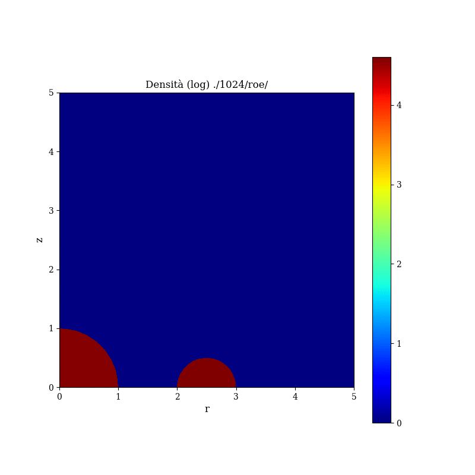

# Tirocinio INAF 2020
Modelli fluidodinamici con [Pluto].

## Sedov
Simulazione di una blast wave di Sedov-Taylor. Codice incluso tra gli esempi di [Pluto].

## Supernova
Simulazione della fase di espansione di Sedov per un SNR, in 2D, con simmetria cilindrica, in mezzo ambiente disomogeneo, e cioé con un ring denso attorno al SNR. Il setup è mostrato nella figura.

Contiene:
- varie run svolte con risoluzioni diverse (128x128, 256x256, 512x512, 1024x1024) e solver diversi (hll, hllc, roe). Ad esempio, una run svolta a 512^2 punti e con solver roe si trova in '512/roe/' 
- run svolte con smoothing delle condizioni iniziali abilitato, in `SmoothingEnabled/`
- `solv-test-*.pdf`, generato con `tracer_analyze.py solv n`, che mostra la massa delle regioni con più del 90% di materiale appartenenti a SNR (tr1) o ring denso (tr2), con risoluzione 512x512 e solver hll, hllc, roe 
- `conv-test-*.pdf`, generato con `tracer_analyze.py conv n`, che mostra la massa delle regioni con più del 90% di materiale appartenenti a SNR (tr1) o ring denso (tr2), con risoluzioni diverse e solver roe 
- `andamentoM0.pdf`, generato con `M0analyze.py`, che mostra la massa delle regioni con più del 90% di materiale di SNR/Ring all'istante iniziale, confrontato con le rispettive masse settate nelle condizioni iniziali
- `paralSpeedup.pdf`, generato dai dati in `ParalTest/` con `paral_analyze.py`, che mostra lo speedup parallelo di run con 1,2,4 processori
- `tracer_analyze.py`, che richiede `pyPLUTO`, `matplotlib` e `numpy`. Uso: `tracer_analyze.py mode n`, con `mode` test da fare (`conv` per il test di convergenza a risoluzioni diverse e solver roe, `solv` per il test di solver a risoluzione 512x512 e solver hll, hllc, roe) e `n` numero del tracer
- `plotasgif.py`, che richiede `pyPLUTO`, `matplotlib`, `numpy` e `imagemagick`. Genera una .gif con i surface plot, anche in scala log, presi ai vari step calcolati, per una variabile scelta. Uso: `plotasgif.py path var steps [--log] [--cmap cmap]`, con `path` path in cui si trovano i file della run, `var` variabile da mostrare a scelta tra `rho, prs, tr1, tr2`, `steps` masssimo numero di passi da mettere nella .gif, `--log` per un grafico di log(var) e `cmap` a scelta tra quelle incluse in matplotlib.

[Pluto]: <http://plutocode.ph.unito.it/>
