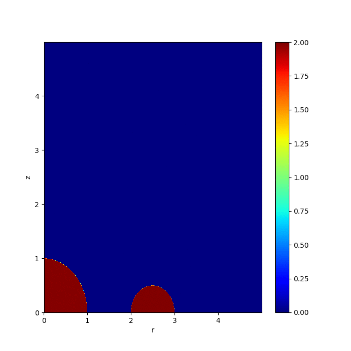
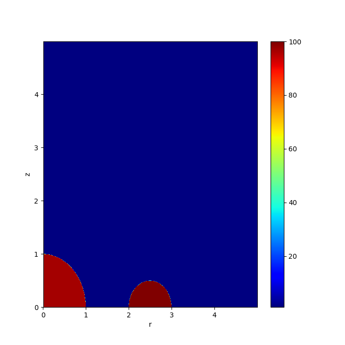

# Tirocinio INAF 2020
Modelli fluidodinamici con [Pluto].

## Sedov
Simulazione di una blast wave di Sedov-Taylor. Codice incluso tra gli esempi di [Pluto].

## Supernova
Simulazione della fase di espansione di Sedov per un SNR, in 2D, con simmetria cilindrica, in mezzo ambiente disomogeneo, e cioé con un ring denso attorno al SNR. Il setup è mostrato nella figura.

Contiene:
- varie run svolte con risoluzioni diverse (128x128, 256x256, 512x512, 1024x1024)
- `andamentoMassatr1.pdf`, generato con `tracer_analyze.py 1`, che mostra la massa delle regioni con più del 90% di materiale stellare (appartenente al SNR)
- `andamentoMassatr2.pdf`, generato con `tracer_analyze.py 2`, che mostra la massa delle regioni con più del 90% di materiale appartenente al ring denso
- `tracer_analyze.py`, che richiede `pyPLUTO`, `matplotlib` e `numpy`. Uso: `tracer_analyze.py n`, con `n` numero del tracer

[Pluto]: <http://plutocode.ph.unito.it/>